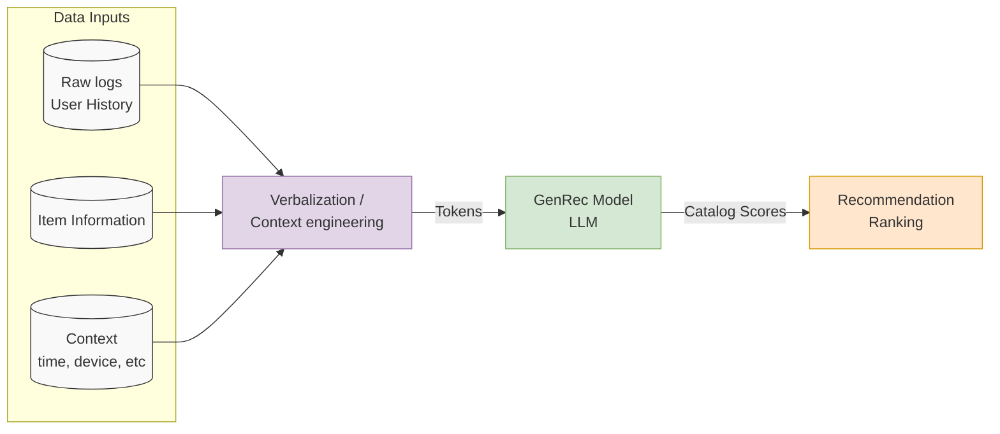

# Gen Rec 
A LLM backed recommendation ranker built on top of an in house foundational LLM .It has 2 phases, phase 1: adapt an opensource LLM to netflix data developing deep understanding of data of catalog and member behaviour phase 2: post train with recommendation specific data labels  and reward signals aiming to align with business requirements and long term member satisfaction
old systems need redesigning models and pipelines for any new features while LLM enables steering recomendation via prompts.

## Post Training Data
At netflix user generate billoons of interactions like viewing playing , thumbing etc 
to post train members histroical interaction is transformed into interaction data into single or mu;ti turn conversation with an assiatnt message representing members actual engagement for the turn 

Each conversation contains 
• Context: surface, time, device, locale, etc.
• User profile & history: country, tenure, plan, historical
interactions, etc.
• Item-level detail: item IDs, item metadata (title name,
release time, synopsis, etc.), popularity trends, etc.
• Task: for example, predict the next items that the user will
play or thumb up
• Assistant message: the user’s implicit or explicit feedback
(play, play duration, abandon, thumb, etc.), which acts as
the ground-truth signal during training.

This conversational framing provides a
unified way to express rich recommendation logs as text, which is
then used to train both the language modeling objective and the
catalog-aware ranking objective 

## Input Verbalization and Context Engineering
GenRec verbalizes rich user interaction histories and context as natural
language or lightly structured text. Verbalization is not merely converting signals into text; it requires deliberate context engineering

• Retain in full: high-signal engagements, such as long-duration
plays and thumbs-up events, are verbalized with richer
metadata.
• Omit entirely: recent, low-signal events—such as very
short plays or noisy views/clicks—are omitted, as they contribute little to ranking quality relative to their token cost.
• Summarize or compress: repetitive behaviors, such as
binge-watching sessions, are compressed instead of listing
every event repeatedly.
• Elaborate selectively: for important items (e.g. new releases or cold-start items)
metadata to compensate for the limited information available from the pretrained model and historical interactions.
Within the fixed token budget, Gen rec prioritize short-to medium-term
history with higher granularity, while older history is either omitted or compressed into a brief user-interest summary. The overall
goal is to construct a compact set of highly informative tokens that
preserves recommendation quality without exceeding the context
window or incurring prohibitive inference costs.

##Post-Training Objective

(1) Recommendation ranking objective
(2) Language modeling objective.

L = 𝛼 · Lranking + 𝛽 · Llanguage +𝛾 · Lmiscellaneous
s.t. 𝛼 + 𝛽 +𝛾 = 1, 𝛼, 𝛽,𝛾 ≥ 0
The 𝛼, 𝛽, 𝛾 are tunable hyperparameters which can be tuned
through offline experiments.

##  Model Architecture
GenRec’s backbone architecture closely follows the foundational
LLM: a decoder-only Transformer trained with next-token-prediction
style objectives. 

# Reward Signals
1) Respect business requirements
(2) Maximize long-term member satisfaction

# Links
netflix case study https://arxiv.org/pdf/2608.10257